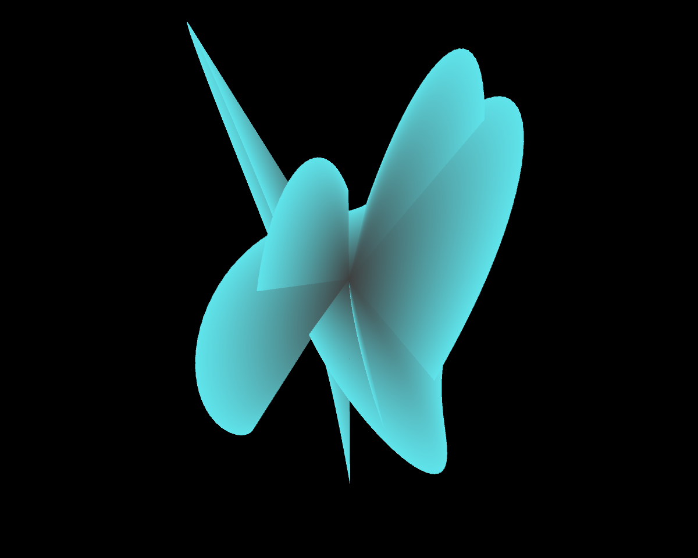
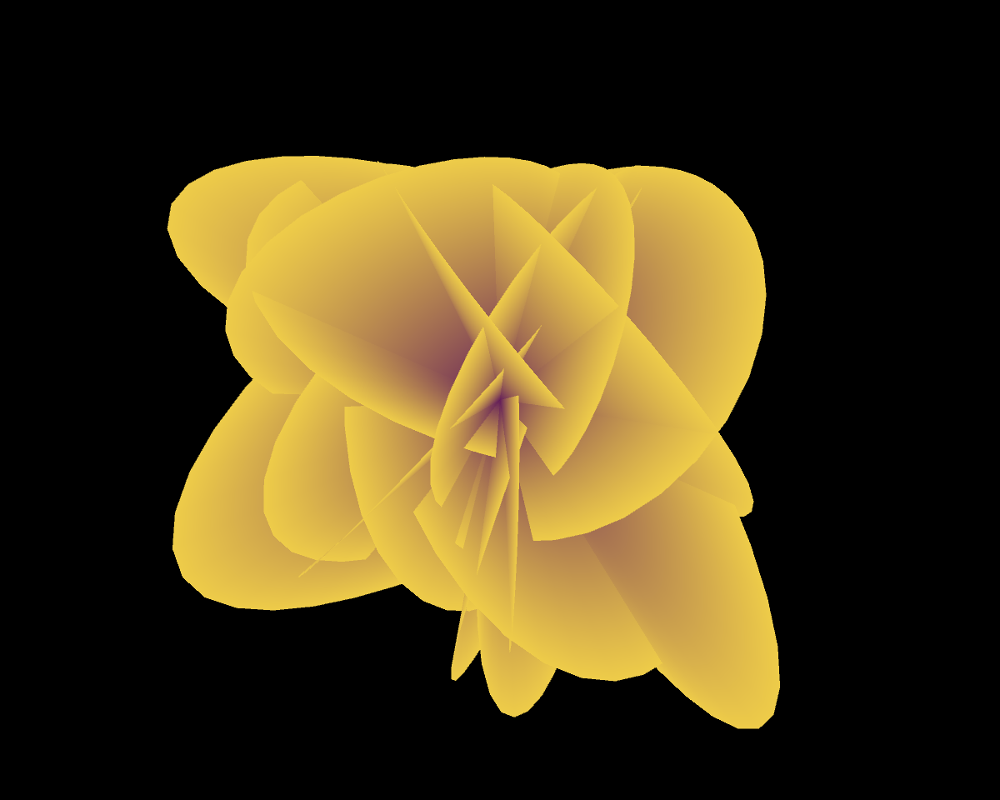
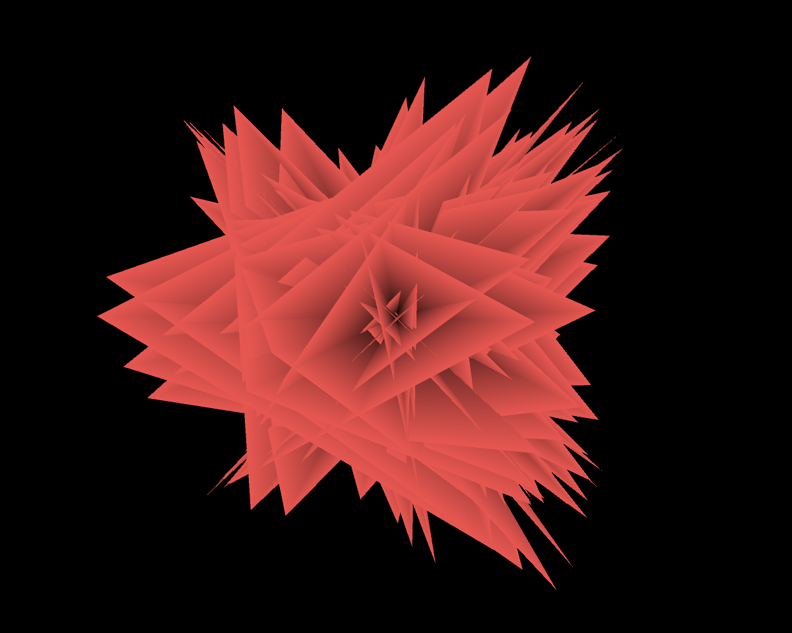

## Parametric 3D Lissajous Figures Drawing

This Processing sketch creates parametric 3D Lissajous figures, based on the code from http://www.generative-gestaltung.de/1/M_2_4_01. It also presents the GUI to control parameters. 

#### Constants

- Lissajous figures points range: 1-500
- Scale factor range: 1-(sketch height / 2)
- X, y, z frequency ranges: 1-200
- X, y phase range: 0-180

#### Variables

- Number of drawing points (i.e. resolution)
- X, y, z frequnecy values
- X, y phase values
- Center fill color
- Fill color
- Boolean for drawing outlines

In drawing Lissajous figures, the number of drawing points and the frequency values of x, y, and z axes determine the whole shape and its pattern. Overall, the higher the values are, the more complicated the shape is. The ranges of these values were chosen empirically, by tweaking numbers to some extent where the shape is not 'meaningfully' distinguishable.

### Screenshoots

