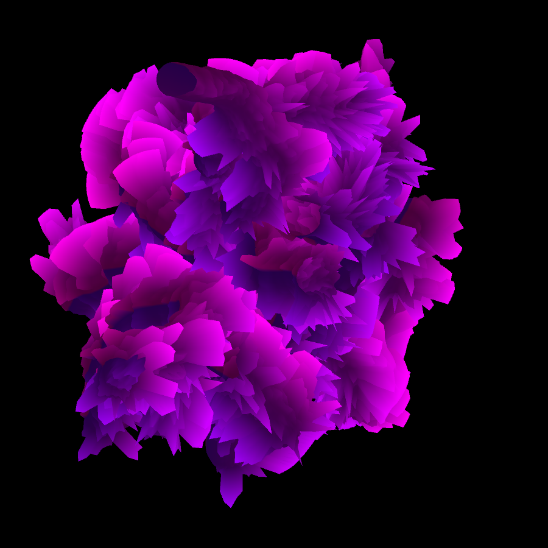

## Sound Reactive Generative Brush based on FFT Analysis

This Processing sketch presents a brush interface that allows the user to draw lines that visualize the frequency spectrum of audio data coming from a mic in real time. Based on the FFT analysis of the Processing audio library, Minim, it visualizes the frequency spectrum as a circular shape which is used as a basic brush pattern. As the user drags the mouse, it continuously draws circular spectrum shapes, as a result, becoming connected lines. For controlling shapes, it provides sliders for parameters, such as a hue range that is mapped to a frequency spectrum range, a minimum/maximum stroke width, a spectrum scaling factor, and a rotation value that determines the start position of circular patterns.

Drawn strokes can be updated with new audio data by toggling "Live Update" button. Whereas this mode updates lines in order that there were drawn, "Sync" mode updates all drawn lines at the same time.

In a generative mode that is activated by clicking the "Generative" toggle button, lines are generated randomly on the screen. And the hue range, the rotation angle, the stroke width also can be randomly selected by turning on "Ramdon" toggles individually. In the generative mode, the drawing movement of shapes are basically chosen by random values, but the user can choose to use a Perlin noise function through the UI. The user also can control the drawing interval between line vertices and maximum vertices that will determine the length of a line.

### Screenshoots

#### 1) Fixed color and stroke width, random rotation, and movment with Perlin noise

#### 2) Random color, random stroke width, random rotation, and movment with Perlin noise

#### 3) Random color, random stroke width, fixed rotation, and random movment with shorter interval and less vertices

### Video Documentation

#### 1) Overall UI demonstration

- https://youtu.be/GnLcdk68MgE

#### 2) Generative mode with real-time sound

- https://youtu.be/DA0-65dhjts
- https://youtu.be/nKSLC-egi04
- https://youtu.be/L0qfQwKpX1g