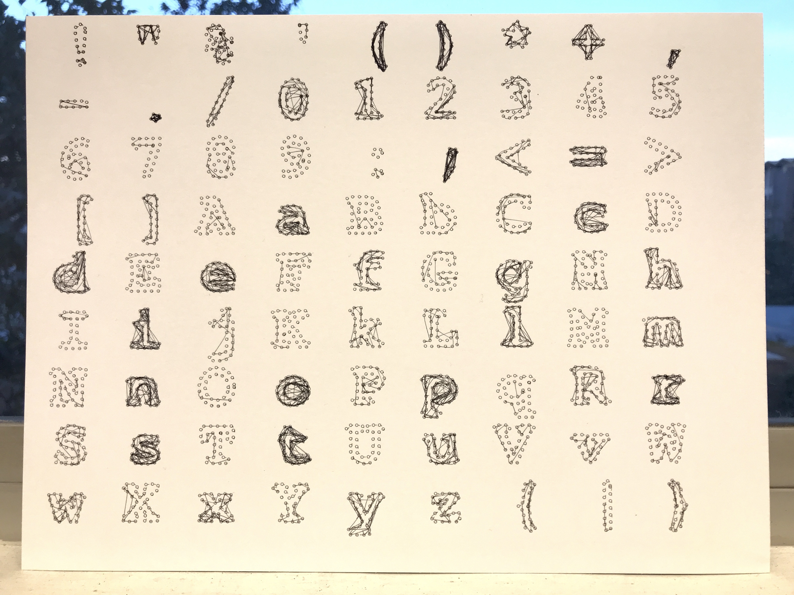
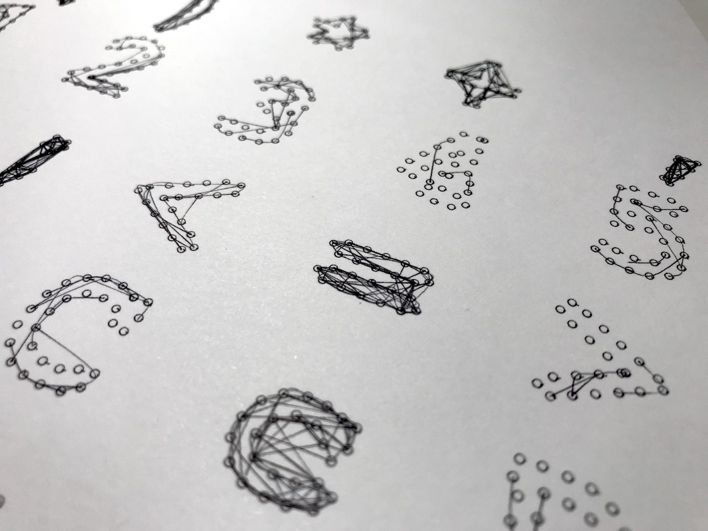
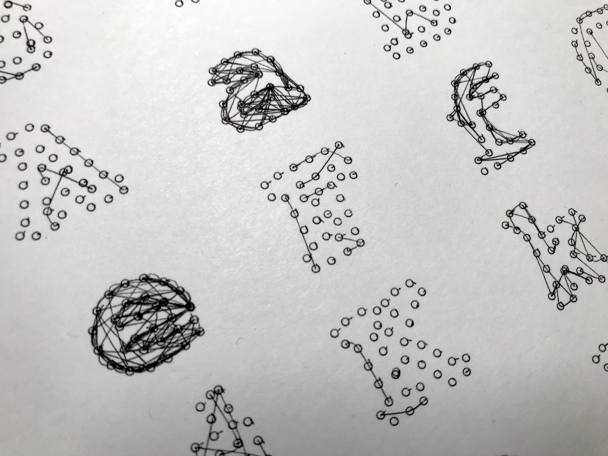
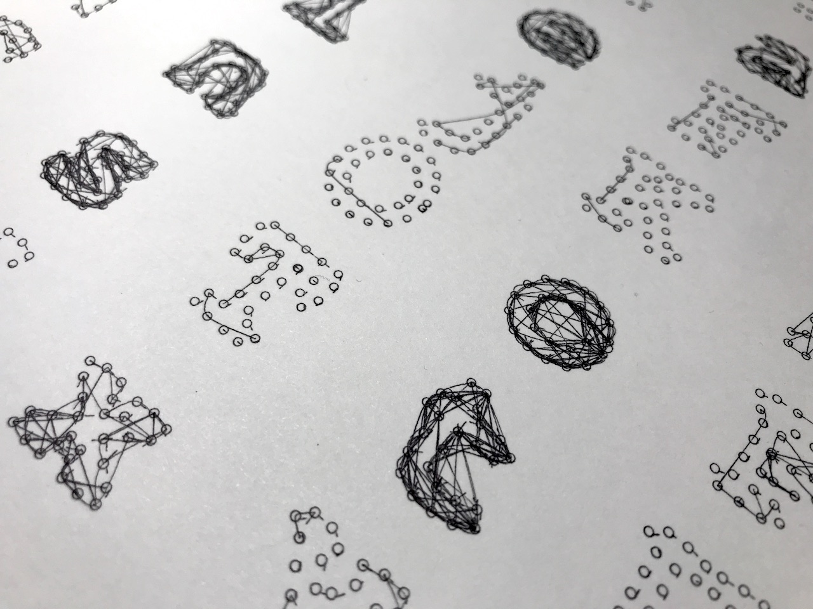
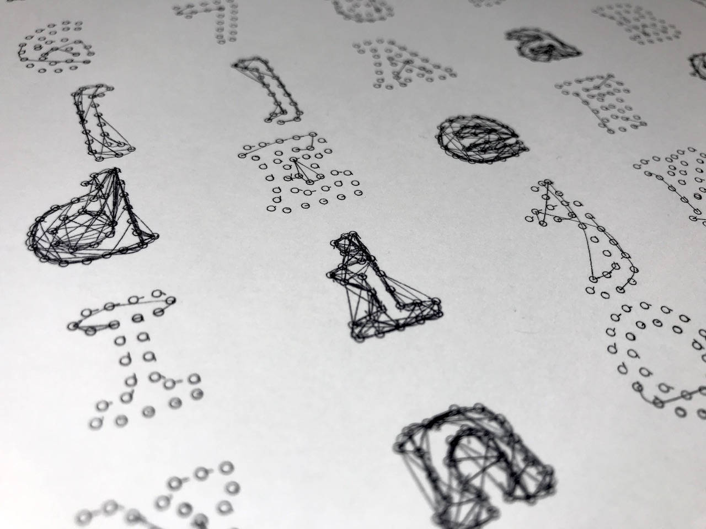

## Create a Plotter Drawing

This Processing sketch read the source code of the sketch itself, counts the number of each character and visualizes the letter frequency by drawing lines on the quantized points of letters' contours. The more lines are, the more a character appears in the code. It is a data visualization project creating generative small patterns.

* *What new challenges or constraints did the plotter add when creating computational art and design?*

As the first attempt, I drew dots representing the shapes of letters. But when they were drawn on a paper, it was not clear because of my choice of a pen. Also, the dots were concealed or too much overlapped by a bunch of lines, sometimes the ink of the lines got spread. So this constraint made me change dots with circles and use a thin pen I personally had.

I spent about a half-hour struggling with not only the above challenge but also finding the decent position of a pen at the plotter arm. Because of an hour time limit, I had to draw with a single black color instead of the original idea that uses two colors, of which one is red for background circles and the other is black for lines. Even it took more than 50 minutes in drawing the total 2,335 circles and 2,334 lines. It made me think about how hard it is estimating the time the plotter would take to draw my sketch.

* *What new expressive opportunities (if any) did the plotter offer over screen-based output?*

In this time, I purposely tried to avoid just abstract or geometric drawings and to find a different possible use of the plotter. The most important thing in creating plottable drawings is always to think about the actual output and the way the plotter moves and the order of drawing elements. With proper consideration of the types of pens and layers of colors, it would be possible to create more natural drawings and use the effects of drawing utensils. The result could benefit from a point where a human cannot draw with such precision or repetition the plotter has and digital printings cannot have such naturalness in visuals.

### Result

